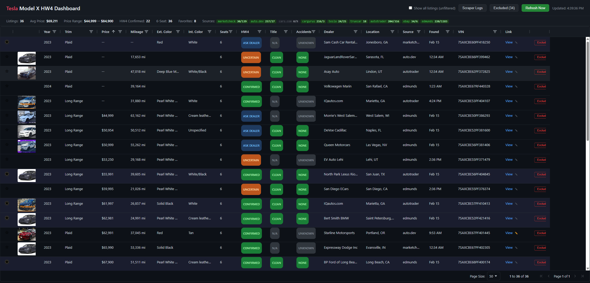

# Tesla Model X HW4 Dashboard

A local dashboard that aggregates used Tesla Model X listings from 8 sources, automatically detects HW4 hardware from the VIN, and filters for non-black interiors, 6-seat configurations, clean titles, and no accident history.



## Features

### Multi-Source Aggregation
Pulls listings from **8 sources** simultaneously and deduplicates by VIN:

| Source | Method | Data Quality |
|--------|--------|-------------|
| MarketCheck | REST API | Price, mileage, colors, dealer, title status, accident history |
| AutoTrader | API scraping | Full listing details with images |
| Edmunds | nodriver (undetected Chrome) | Full specs, battery health, title/accident history via Redux store |
| Tesla Inventory | nodriver (undetected Chrome) | Official Tesla CPO/used inventory |
| TrueCar | fetch + Cheerio | Price, mileage, trim, dealer info via JSON-LD |
| eBay Motors | eBay Browse API + Playwright | Auction and fixed-price listings |
| Cars.com | fetch + Cheerio | Embedded JSON with VIN and colors |
| CarGurus | fetch + Cheerio | Listing details and deal ratings |

### VIN-Based Intelligence

- **HW4 detection** from VIN serial number heuristics:
  - 2024+ Model X = **Confirmed** HW4
  - 2023 serial > 390,000 = **Confirmed**
  - 2023 serial 385,000-390,000 = **Likely**
  - 2023 serial 370,000-385,000 = **Uncertain** (flagged for manual verification)
- **Seat count** decoded from VIN position 6 (5/6/7 seat)
- **Trim** decoded from VIN position 8 (Long Range vs Plaid)
- **Tesla option codes** parsed when available for definitive HW4/interior/seat confirmation

### Smart Filtering

The default view applies all filters automatically:
- HW4 hardware only (confirmed, likely, or uncertain)
- Non-black interiors (detects "All Black", "Ebony", "Charcoal", "Blk" variants; keeps two-tones like "Black and White")
- 6-seat configuration (captain's chairs)
- Clean title only (excludes salvage, rebuilt, flood, lemon, branded)
- No accident history
- Toggle "Show all listings" to see the full unfiltered dataset

### Interactive Dashboard

- **AG Grid** with sorting, column filtering, and pagination
- **Color-coded HW4 badges** — click to manually cycle status (confirmed/likely/uncertain/ask dealer/no)
- **Favorite/star** listings to pin them to the top
- **Exclude** listings with optional reason (e.g., "bad photos", "overpriced")
- **Thumbnail images** from listing photos
- **Direct links** to original listings on dealer sites
- **Per-source scraped counts** in the header (e.g., `edmunds 220/1183` = 220 scraped, 1183 primary in DB)
- **Summary bar**: total listings, average price, price range, HW4 confirmed count, 6-seat count, favorites count

### Source Selection

Choose which sources to refresh — skip slow scrapers when you only need a quick update from the API sources.

### Data Persistence

- **SQLite database** (`bun:sqlite`) stores all listings with UPSERT logic
- **Price history tracking** — records every price change with timestamp
- **Excluded VINs** persist across refreshes with reasons
- **HW4 manual overrides** survive data refreshes
- **Favorites** persist independently

## Tech Stack

- **[Bun](https://bun.sh)** — runtime, HTTP server, SQLite, bundler
- **[AG Grid Community](https://www.ag-grid.com/)** — data grid (CDN, no build step)
- **[Playwright](https://playwright.dev/)** — headless browser for eBay, Cars.com, CarGurus scrapers
- **[nodriver](https://github.com/nicegui-io/nodriver)** — undetected Chrome for Edmunds and Tesla (bypasses Akamai Bot Manager)
- **[Cheerio](https://cheerio.js.org/)** — HTML/JSON-LD parsing
- **[MarketCheck API](https://www.marketcheck.com/)** — primary data source (requires API key)
- **[NHTSA vPIC API](https://vpic.nhtsa.dot.gov/api/)** — free VIN decoding

Zero frontend build step. Single HTML file with inline CSS/JS served by Bun.

## Setup

### Prerequisites

- [Bun](https://bun.sh) v1.3+
- [Node.js](https://nodejs.org) 18+ (required for Playwright subprocess — Bun has a pipe incompatibility with Playwright)
- [Python](https://python.org) 3.10+ with `nodriver` package (for Edmunds and Tesla scrapers)
- A [MarketCheck](https://www.marketcheck.com/) API key (free tier available)

### Install

```bash
git clone https://github.com/arm3n/tesla-model-x-dashboard.git
cd tesla-model-x-dashboard
bun install
npx playwright install chromium
pip install nodriver
```

### Configure

Create a `.env` file in the project root:

```env
MARKETCHECK_API_KEY=your_api_key_here
MARKETCHECK_API_SECRET=your_api_secret_here

# Optional: eBay Browse API credentials
# EBAY_CLIENT_ID=
# EBAY_CLIENT_SECRET=
```

### Run

```bash
# Start the dashboard server
bun run dev

# Open http://localhost:3000
```

### Refresh Data

Click **Refresh Now** in the dashboard, or run from the command line:

```bash
bun run refresh
```

## Architecture

```
src/
  server.ts              Bun.serve() on port 3000
  db.ts                  SQLite via bun:sqlite (listings, price_history, excluded, favorites, hw4_overrides)
  normalize.ts           Deduplication, VIN enrichment, filtering logic
  scraper/
    marketcheck.ts       MarketCheck REST API
    auto-dev.ts          Auto.dev REST API
    autotrader.ts        AutoTrader API scraping (multi-sort strategy)
    tesla.ts             Tesla inventory (nodriver subprocess)
    truecar.ts           TrueCar (fetch + Cheerio, JSON-LD extraction)
    edmunds.ts           Edmunds (nodriver subprocess, __PRELOADED_STATE__ extraction)
    ebay-motors.ts       eBay Motors (Browse API + Playwright details)
    cars-com.ts          Cars.com (fetch + Cheerio)
    cargurus.ts          CarGurus (fetch + Cheerio)
    run-in-node.ts       Node.js subprocess bridge for Playwright
    types.ts             Shared Listing/RawListing interfaces
  vin/
    hw4-check.ts         HW4 heuristic, seat count, trim from VIN
    decoder.ts           NHTSA vPIC API integration
    option-codes.ts      Tesla option code decoder
scripts/
  refresh.ts             Orchestrates all scrapers with progress callbacks
  pw-scraper-runner.ts   Node.js entry point for Playwright scrapers
  edmunds-fetch.py       Python nodriver scraper for Edmunds (anti-detection, paginated)
  tesla-fetch.py         Python nodriver scraper for Tesla inventory
public/
  index.html             Single-file dashboard (AG Grid + vanilla JS)
```

## API Endpoints

| Method | Path | Description |
|--------|------|-------------|
| GET | `/api/listings` | Filtered listings (`?all=true` for unfiltered) |
| GET | `/api/sources` | Per-source scraped counts and DB attribution |
| POST | `/api/refresh` | Start data refresh (`{ sources: ["marketcheck"] }` for selective) |
| GET | `/api/refresh/progress` | Poll refresh progress (`?since=timestamp`) |
| POST | `/api/exclude` | Exclude a VIN (`{ vin, reason }`) |
| DELETE | `/api/exclude` | Restore an excluded VIN (`{ vin }`) |
| GET | `/api/excluded` | List all excluded VINs |
| POST | `/api/hw4` | Override HW4 status (`{ vin, hw4Status }`) |
| POST | `/api/favorite` | Favorite a VIN (`{ vin, note }`) |
| DELETE | `/api/favorite` | Unfavorite a VIN (`{ vin }`) |
| GET | `/api/favorites` | List all favorites |
| GET | `/api/scraper-logs` | Scraper run history with per-source stats |

## HW4 Detection Logic

Tesla transitioned from HW3 to HW4 during the 2023 model year. The VIN encodes enough information to determine hardware version with high confidence:

```
VIN: 7 S A X C B E 5 _ P F 3 8 5 1 2 3
     1 2 3 4 5 6 7 8 9 10 11  [serial]

Position 4  = X         Model X
Position 6  = B         6-seat (captain's chairs)
Position 8  = 5         Long Range AWD
Position 10 = P         2023 model year
Serial      = 385123    > 385,000 = HW4 likely
```

| Model Year | Serial Range | HW4 Status |
|-----------|-------------|------------|
| 2024+ | Any | Confirmed |
| 2023 | >= 390,000 | Confirmed |
| 2023 | 385,000 - 389,999 | Likely |
| 2023 | 370,000 - 384,999 | Uncertain |
| 2023 | < 370,000 | No |
| 2022 and earlier | Any | No |

## License

MIT
